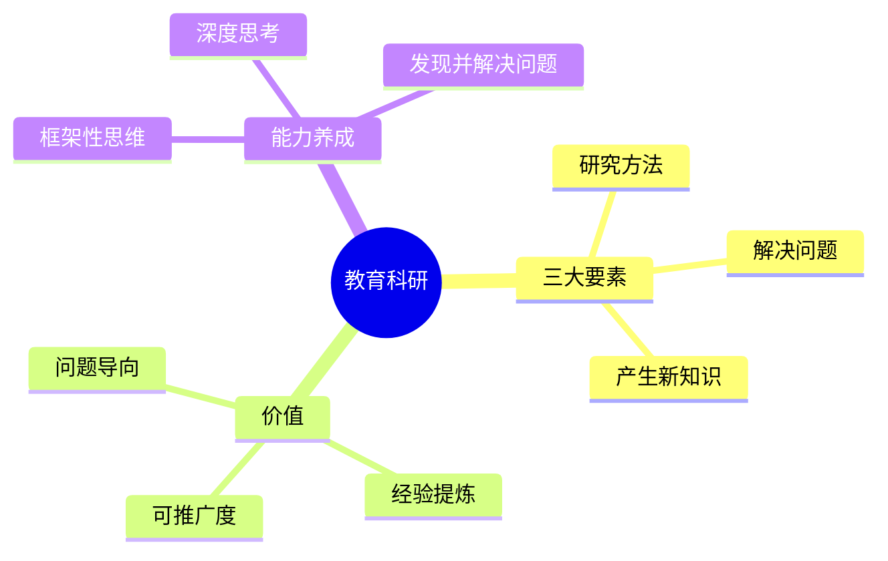

# 结构化测试文件：核心格式与代码承载

## 文本样式与排版

这是一个正常的段落，用于测试正文的**默认字体**和**行高**。

---


### 强调与引用
**加粗：** 我们需要**立即启动**项目。
*斜体：* *这是对重要概念的补充。*
~~删除线：~~ ~~旧的方案已经废弃。~~
> 引用块用于区分核心观点和外部参考资料。
> *“最小可行产品（MVP）是工程化思维的关键。”*

---

### 表格
| 设置项                     | 作用      | 我的配置                        |
| ----------------------- | ------- | --------------------------- |
| `folder`                | 同步目标文件夹 | `Wechat/David-Writing-Team` |
| `singleFileName`        | 同步目标文件名 | `素材库`                       |
| `dateSavedFormat`       | 日期格式    | `yyyy-MM-dd`（无时间）           |
| `wechatMessageTemplate` | 消息模板    | `---\n### 📅 {日期}\n{内容}`    |

# 一级标题
一级标题测试
## 二级标题
二级标题测试
### 三级标题
三级标题测试
#### 四级标题
四级标题测试

##### 五级标题
五级标题测试

###### 六级标题
六级标题测试

### Mermaid 思维导图



检查侧边栏预览中各节点文字是否垂直居中、没有飘出色块；复制或同步到公众号后，PNG 中的文字位置应与预览一致。


### 列表嵌套示例
1.  **第一步：** 准备数据
    * 清洗数据 (Python)
    * 标准化特征 (Scaling)
2.  **第二步：** 训练模型
    * 尝试不同的算法：
        * 线性回归
        * 随机森林
3.  **第三步：** 评估结果

-   无序列表也支持嵌套：
    -   子项 A
        1.  子子项 A.1
        2.  子子项 A.2

---

## 代码块测试区

### 1. 短代码块 (内联与简短函数)
内联代码示例：使用 `try...except` 进行异常捕获，然后执行 `print("Done")`。

```javascript
function calculate_area(radius) {
  return Math.PI * radius ** 2; // 这是注释
}
```

### 2. 长代码
```python
# 文件名: data_processor.py
import pandas as pd
import numpy as np

def load_and_clean_data(file_path):
    """
    加载数据，处理缺失值和重复项。
    
    Args:
        file_path (str): 数据文件路径。
    
    Returns:
        pd.DataFrame: 清理后的数据框。
    """
    try:
        df = pd.read_csv(file_path)
    except FileNotFoundError:
        print(f"Error: File not found at {file_path}")
        return pd.DataFrame() # 返回空数据框作为止损
    
    initial_rows = len(df)
    
    # 1. 处理缺失值 (使用均值填充数值型，使用众数填充类别型)
    for col in df.columns:
        if df[col].dtype in ['int64', 'float64']:
            df[col].fillna(df[col].mean(), inplace=True)
        elif df[col].dtype == 'object':
            df[col].fillna(df[col].mode()[0], inplace=True)
            
    # 2. 删除重复行
    df.drop_duplicates(inplace=True)
    
    final_rows = len(df)
    
    print(f"数据清理完成：原始 {initial_rows} 行，现存 {final_rows} 行。")
    return df

# 这是一个长长的函数调用示例，旨在测试编辑器对长行和多行的支持能力。
if __name__ == '__main__':
    # 假设 'path/to/my_data.csv' 是一个实际的文件路径
    cleaned_data = load_and_clean_data(
        file_path="path/to/my_very_important_and_long_named_input_data_file_for_testing.csv"
    )
    
    if not cleaned_data.empty:
        # 进行一些简单的数据聚合操作
        print("\n--- 数据聚合 ---")
        summary = cleaned_data.groupby('Category')['Value'].agg(['mean', 'std', 'count'])
        print(summary)
    
    # 最后，添加一些额外的空行和缩进，确保代码块格式不会被破坏
    
    
    
    
    
    # 额外的代码行，用于测试代码块的最小高度要求和滚动支持
    for i in range(10):
        if i % 2 == 0:
            print(f"Processing item {i}")
        else:
            # 这是一个非常长的注释，旨在测试编辑器的水平滚动或自动换行能力。
            # 务必确认，即使是超长的注释行，也能在代码块中清晰显示。
            pass
```
